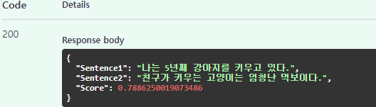
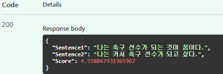
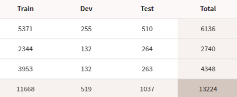
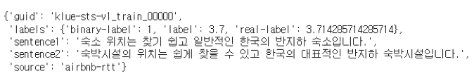
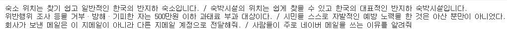
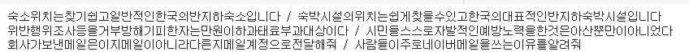
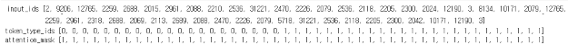
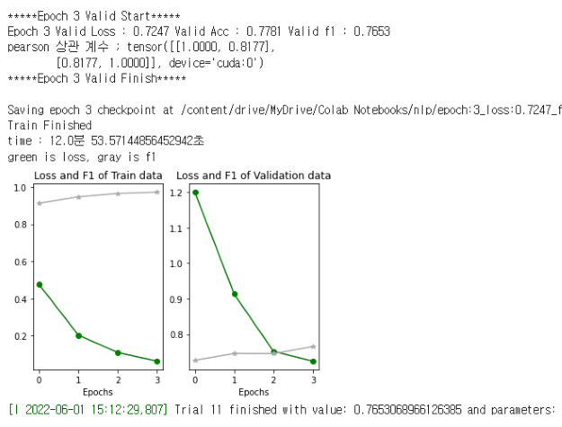
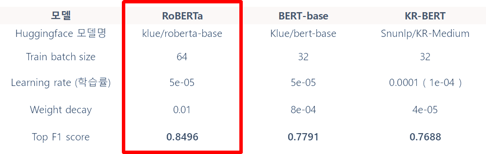
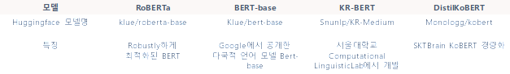

# BERT Fine-Tuning을 통해 두 문장 사이의 유사도 파악 ( STS )

### 시연 결과 ( 영상은 아래 [# API : FastAPI](#api--fastapi))

  

# 개요

- Pytorch, HuggingFace 라이브러리를 이용해 BERT를 Fine-Tuning

- 배경 : 문장 유사도 분석 ( STS, Semantic Textual Similarity )는 주어진 두 텍스트가 의미적 혹은 문맥적으로 얼마나 유사한지를 분석하여 수치적으로 나타내는 것이 주 목적이다.
- 프로젝트 목표
  1. 기존 연구와 모델의 재현
  2. 기존 모델보다 성능 향상시키는 것이 목표
- Dataset : KLUE-STS
- Klue/bert-base, KR-BERT, RoBERTa 모델을 Fine-Tuning하여 구현, API로 시연
- 활용 장비 및 재료(개발 환경 등)
  - Colab Pro ( GPU : T4, P100 / RAM : 최대 25.51GB / CPU : Intel(R) Xeon(R) CPU @ 2.30GHz )

# Dataset : KLUE-STS

- KLUE-STS 데이터셋 정보  

- KLUE-STS 데이터셋 예시  

- Label : 0(의미 중복 없음) ~ 5(의미 동등) 혹은 이진값(임계값 3.0)

## Data Preprocessing

- Re.sub를 통해 한글을 제외한 다른 문자, 공백 제거 시도
  - re.sub를 적용하지 않고(원본으로) 훈련시켜보았을 때 원본으로 했을 때가 더 높게 나왔다.
    - 영어와 특수문자(마침표)도 token_id가 있다. 
    - 위치, 위치#, #위치 등 같은 의미이지만, 다른 token_id가 있어 공백을 제거하였을 때 의미를 해칠 수도 있다.
- Pre-training된 모델의 tokenizer를 통해 tokenizing

- sentence 데이터  

- re.sub 적용  

- tokenizer 적용  

# Model Class

- BERT일 경우, BertForNextSentencePrediction 클래스로 Pre-trained된 모델을 받아서 Fine-Tuning => 문장의 유사성(STS)과 다음 문장 예측(NSP)은 목적이 다르다. BertModel에 layer를 쌓아 STS를 구하는 것이 낫다. 
- RoBERTa일 경우 아래 3가지 방법으로 진행
  - RoBERTModel을 받아 2 layer 추가(STS)
  - AutoModelForSequenceClassification를 통해 분류
  - SentenceTransformer와 EmbeddingSimilarityEvaluator을 통해 분류

- [예시 코드](preprocessing_to_model.ipynb) : preprocessing 부터 model class code를 담고 있는 파일

 

## 평가 지표

- F1-score 
  - 0.0 ~ 1.0 사이의 값을 가지며 높을수록 좋다.
  - 클래스가 불균형할 때 정확도보다 좋은 지표로 작용한다.
  - Score(0 ~ 5 의 값)에서 **3.0을 임계값**으로 하여 3보다 작으면 False(유사하지 않음), 크거나 같으면 True(유사)로 분류하여 f1 score을 계산한다.
- Loss : F1-score가 근사할 경우 loss가 작은 모델을 최적화 모델로 결정하였다.
  - 

 

# HyperParameter 조정

- 결과 : BERT의 경우, pre-trained되어있기 때문에 파라미터(batch_size, learning rate) 조정 보다 데이터의 크기가 성능 향상에 더 도움이 된다.

- 하이퍼파라미터 조정 과정

  

- Optuna 모듈  사용

- HyperParameter
  - Pre-training된 모델  
    
  - Epoch : 저자 권장에 따라 4 Epoch 이하로 훈련
  - Train data의 batch size : 16, 32, 64
  - 학습률 ( Learning rate )
    - [0.01, 1e-3, 5e-5, 3e-5, 2e-5, 1e-6] 에서 범위 탐색
    - -> 5e-5 ~ 5e-5 사이의 로그 함수 선상 값으로 다시 하이퍼파라미터 탐색 
      * 0.01일 경우에 너무 크기 때문에 overshooting.
      * 1e-6일 경우에 local minima에 빠지는 경우 발생
  - Weight  decay
    - 4e-5 ~ 1e-3 사이의 로그 함수 선상 값
    - 과적합 방지하기 위해 학습 중 loss function에 weight가 커질 경우에 대한 패널티 항목을 넣어 weight가 너무 커지지 않게 하는 방법
- [optuna 모듈을 사용하여 HyperParameter 조정한 기록 보기(code)](practice/%EC%B5%9C%EC%A7%80%ED%98%84_sts.ipynb)

  

# API : FastAPI

- API 구동 방법 ( ckpt 파일을 main.py와 같은 경로에 두고 테스트하면 됩니다. )
> 1. python -m uvicorn main:app --reload
> 2. http://127.0.0.1:8000/docs로 접속
> 3. ctrl + c 로 종료

- 시연 영상  
  -     
  -    
  -  